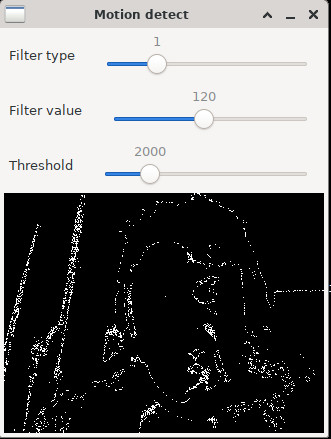

# CamCV

Motion detect on webcam.  
Learn differences from previous and current image then trigger action when diff ratio greater than tolerance.  

## Requirements

* Boost lib (v1.78.0)
* OpenCV lib (v4.x)
* C++ compiler (v10.2.1)

## Setup

### Debian
``` 
sudo apt install cmake libboost-all-dev libopencv-dev
```

## Build
``` 
./build.sh
```

## Run
``` 
./run.sh
```

## Devices
Identify cam devices
``` 
#!/bin/bash

for f in /dev/video*; do
    item="$(basename -- $f)"
    name="$(cat /sys/class/video4linux/$item/name)"
    echo "$f  =>  $name"
done
``` 
## Screenshot



## Usage

``` 
./run.sh
```
Display help
``` 
./build/camcv --help

Usage camcv [options]:
  --help                help options
  --d arg               set device id
  --t arg               set threshold
  --w arg               set width
  --v arg               set verbosity
  --i arg               set capture interval
  --s arg               save image
  --ft arg              filter type
  --fv arg              filter value
  --gui arg             use GUI
```
Sample run options
```
./build/camcv --d 0 --t 1000 --w 320 --v 1 --i 2 --s 1
```
In this case we :
* use first video device (/dev/video0)
* set threshold with 1000 as diff value from compare
* set capture dimension to 320x240
* enable verbosity as info
* capture every 2 frames
* save image on motion detect

### Gui
* 'm' toggle diff/real mode.
* Filter type [0..4] (Binary, Binary Inverted, Truncate, To Zero, Zero Inverted)
* Filter value

## Perfomances

Check Cpu load
```
top -c -p $(pgrep -d',' -f camcv)
```

* On i5-3320M, 320x240, filter activated, load is 2.7% per instance
* Consider file saving as greedy

## Looking further
* Zoning [there](https://github.com/cedricve/motion-detection)
* [OpenCV](https://github.com/joachimBurket/esp32-opencv) on esp32
